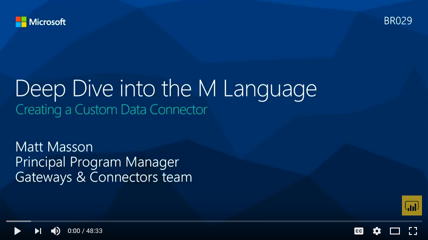

# Getting Started with Data Connectors

Data Connectors for Power BI enables users to connect to and access data from your application, service, or data source, providing them with rich business intelligence and robust analytics over multiple data sources. By integrating seamlessly into the Power Query connectivity experience in Power BI Desktop, Data Connectors make it easy for power users to query, shape and mashup data from your app to build reports and dashboards that meet the needs of their organization.

Data Connectors are created using the [M language](https://msdn.microsoft.com/library/mt211003.aspx). This is the same language used by the Power Query user experience found in Power BI Desktop and Excel 2016. Extensions allow you to define new functions for the M language, and can be used to enable connectivity to new data sources. While this document will focus on defining new connectors, much of the same process applies to defining general purpose M functions. Extensions can vary in complexity, from simple wrappers that essentially just provide "branding" over existing data source functions, to rich connectors that support Direct Query.

Please see the [Data Connector technical reference](docs/m-extensions.md), and [TripPin tutorial samples](samples/TripPin) for more information.

## Quickstart

> **Note:** The steps to enable extensions changed in the June 2017 version of Power BI Desktop.

1. Install the [Power Query SDK](https://aka.ms/powerquerysdk) from the Visual Studio Marketplace
2. Create a new Data Connector project
3. Define your connector logic
4. Build the project to produce an extension file
5. Create a `[My Documents]\Power BI Desktop\Custom Connectors` directory
6. Copy the extension file into this directory
7. Enable the **Custom data connectors** preview feature in Power BI Desktop (under *File | Options and settings | Custom data connectors*)
8. Restart Power BI Desktop

## Gateway Support

Custom Connector support was added to the April 2018 release of the [Personal On-Premises Gateway](https://docs.microsoft.com/en-us/power-bi/service-gateway-onprem#install-the-gateway-in-personal-mode). Please see the [technical documentation](docs/m-extensions.md) for more information on the [TestConnection handler](docs/m-extensions.md#implementing-testconnection-for-gateway-support), and the [TripPin Sample](samples/TripPin/9-TestConnection) for an example of how to add gateway support to your connector.

## Distribution of Data Connectors

Power BI Desktop users can download extension files and place them in a known directory (steps described above). Power BI Desktop will automatically load the extensions on restart.

_We are hard at work on Office Store integration to make it easy for users to discover and install data connectors you build. During this preview phase, developers interested in distributing their connectors for use with Power BI can contact us at DataConnectors (at) microsoft.com. Currently, we are only distributing connectors by vendors and by third party developers acting with permission and on behalf of vendors, not unrelated third party developers._

## Additional Links and Resources

* [Data Connector Technical Reference](docs/m-extensions.md)
* [M Library Functions](https://msdn.microsoft.com/library/mt253322.aspx)
* [M Language Specification](https://msdn.microsoft.com/library/mt807488.aspx)
* [Power BI Developer Center](https://powerbi.microsoft.com/developers/)
* [Data Connector Tutorial](https://github.com/Microsoft/DataConnectors/tree/master/samples/TripPin)

The recording of the [Creating a Custom Data Connector session](https://www.youtube.com/watch?v=ecfRTEoYadI) from the [Microsoft Data Insights Summit 2017](https://powerbi.microsoft.com/en-us/blog/microsoft-data-insights-summit-2017-day-1-recap/) can be found by clicking the image below:

## Hello World Sample

The following code sample defines a simple "Hello World" data source. See the [full sample](samples/HelloWorld) for more information.

<pre style="font-family:Consolas;font-size:13;color:black;background:white;">section&nbsp;HelloWorld;
 
[DataSource.Kind=&quot;HelloWorld&quot;,&nbsp;Publish=&quot;HelloWorld.Publish&quot;]
shared&nbsp;HelloWorld.Contents&nbsp;=&nbsp;(optional&nbsp;message&nbsp;as&nbsp;text)&nbsp;=&gt;
&nbsp;&nbsp;&nbsp;&nbsp;let
&nbsp;&nbsp;&nbsp;&nbsp;&nbsp;&nbsp;&nbsp;&nbsp;message&nbsp;=&nbsp;if&nbsp;(message&nbsp;&lt;&gt;&nbsp;null)&nbsp;then&nbsp;message&nbsp;else&nbsp;&quot;Hello&nbsp;world&quot;
&nbsp;&nbsp;&nbsp;&nbsp;in
&nbsp;&nbsp;&nbsp;&nbsp;&nbsp;&nbsp;&nbsp;&nbsp;message;
 
HelloWorld&nbsp;=&nbsp;[
&nbsp;&nbsp;&nbsp;&nbsp;Authentication&nbsp;=&nbsp;[
&nbsp;&nbsp;&nbsp;&nbsp;&nbsp;&nbsp;&nbsp;&nbsp;Implicit&nbsp;=&nbsp;[]
&nbsp;&nbsp;&nbsp;&nbsp;],
&nbsp;&nbsp;&nbsp;&nbsp;Label&nbsp;=&nbsp;Extension.LoadString(&quot;DataSourceLabel&quot;)
];
 
HelloWorld.Publish&nbsp;=&nbsp;[
&nbsp;&nbsp;&nbsp;&nbsp;Beta&nbsp;=&nbsp;true,
&nbsp;&nbsp;&nbsp;&nbsp;ButtonText&nbsp;=&nbsp;{&nbsp;Extension.LoadString(&quot;FormulaTitle&quot;),&nbsp;Extension.LoadString(&quot;FormulaHelp&quot;)&nbsp;},
&nbsp;&nbsp;&nbsp;&nbsp;SourceImage&nbsp;=&nbsp;HelloWorld.Icons,
&nbsp;&nbsp;&nbsp;&nbsp;SourceTypeImage&nbsp;=&nbsp;HelloWorld.Icons
];
 
HelloWorld.Icons&nbsp;=&nbsp;[
&nbsp;&nbsp;&nbsp;&nbsp;Icon16&nbsp;=&nbsp;{&nbsp;Extension.Contents(&quot;HelloWorld16.png&quot;),&nbsp;Extension.Contents(&quot;HelloWorld20.png&quot;),&nbsp;Extension.Contents(&quot;HelloWorld24.png&quot;),&nbsp;Extension.Contents(&quot;HelloWorld32.png&quot;)&nbsp;},
&nbsp;&nbsp;&nbsp;&nbsp;Icon32&nbsp;=&nbsp;{&nbsp;Extension.Contents(&quot;HelloWorld32.png&quot;),&nbsp;Extension.Contents(&quot;HelloWorld40.png&quot;),&nbsp;Extension.Contents(&quot;HelloWorld48.png&quot;),&nbsp;Extension.Contents(&quot;HelloWorld64.png&quot;)&nbsp;}
];
</pre>

## What You Can Do With a Data Connector

Data Connectors allow you to create new data sources, or customize and extend an existing source. Common use cases include:

- Creating a business analyst friendly view for a REST API
- Providing branding for a source that Power Query supports with an existing connector (such as an OData service, or ODBC driver)
- Implementing an OAuth v2 authentication flow for a SaaS offering
- Exposing a limited/filtered view over your data source to improve usability
- Supporting different authentication modes when creating a [Power BI Content Pack](https://powerbi.microsoft.com/documentation/powerbi-developer-content-pack-overview/)
- Enabling Direct Query for a data source via an ODBC driver

Currently, Data Connectors are only supported in Power BI Desktop.

### Upcoming Changes
Data Connectors are currently in preview. We plan to incrementally roll out a number of enhancements prior to general availability, including:

- [ ] File extension changes (.mez to .pqx)
- [ ] Improved tracing and diagnostics for developing Direct Query capable connectors
- [ ] Versioning of extensions, and support for dependencies
- [ ] Improved support for Library extensions (for reusable utility functions)
- [ ] Integration and support for API Connectors for Microsoft Flow and PowerApps
- [ ] Integration with the Office Store
- [ ] Development experience improvements

Please report issues and feature requests through our [Github issues page](https://github.com/Microsoft/DataConnectors/issues).
