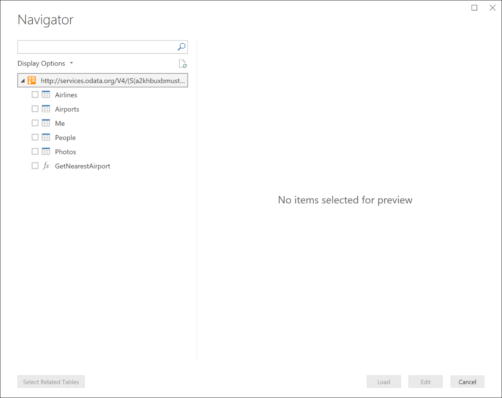
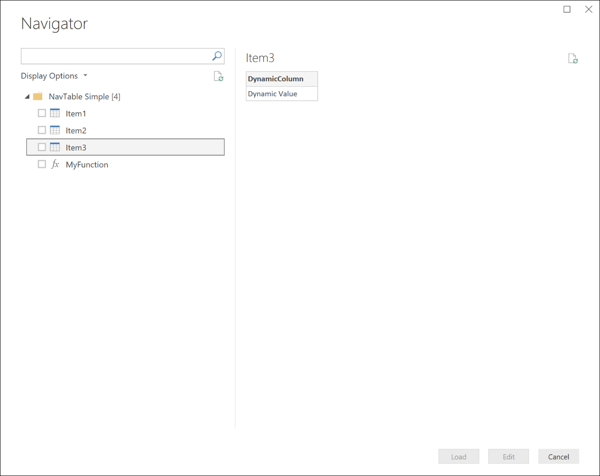
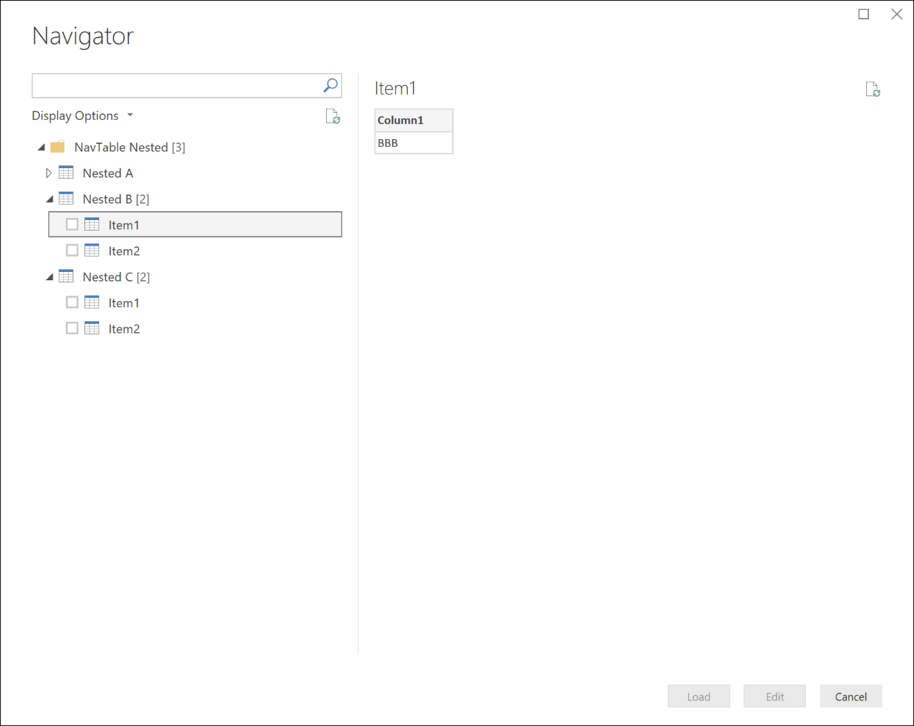

# Using Navigation Tables
Navigation Tables (or nav tables) are a core part of providing a user friendly experience for you connector. The Power Query experience displays them to the user after they have entered any required parameters for your data source function, and have authenticated with the data source. 



Behind the scenes, a nav table is a regular M Table value with specific metadata fields defined on its Type. When your data source function returns a table with these fields defined, Power Query will display the navigator dialog. You can actually see the underlying data as a Table value by right clicking on the root node, and clicking Edit. 


## Table.ToNavigationTable
You can use the `Table.ToNavigationTable` function to add the table type metadata needed to create a nav table. 

> **Note:** You currently need to copy and paste this function into your M extension. In the future it will likely be moved into the M standard library.

```
Table.ToNavigationTable = (
    table as table,
    keyColumns as list,
    nameColumn as text,
    dataColumn as text,
    itemKindColumn as text,
    itemNameColumn as text,
    isLeafColumn as text
) as table =>
    let
        tableType = Value.Type(table),
        newTableType = Type.AddTableKey(tableType, keyColumns, true) meta 
        [
            NavigationTable.NameColumn = nameColumn, 
            NavigationTable.DataColumn = dataColumn,
            NavigationTable.ItemKindColumn = itemKindColumn, 
            Preview.DelayColumn = itemNameColumn, 
            NavigationTable.IsLeafColumn = isLeafColumn
        ],
        navigationTable = Value.ReplaceType(table, newTableType)
    in
        navigationTable;
```
The following table describes the parameters for this function.

| Parameter      | Details         |
|:---------------|:----------------|
| table          | Your navigation table.   |
| keyColumns     | List of column names that act as the primary key for your navigation table      |
| nameColumn     | The name of the column that should be used as the display name in the navigator |
| dataColumn     | The name of the column that contains the Table or Function to display           |
| itemKindColumn | The name of the column to use to determine the type of icon to display. Valid values for the column are `Table` and `Function`.    |
| itemNameColumn | The name of the column to use to determine the type of tooltip to display. Valid values for the column are `Table` and `Function`. |
| isLeafColumn   | The name of the column used to determine if this is a leaf node, or if the node can be expanded to contain another navigation table. |

## Examples
For the full code listing, please see the [NavigationTable](../samples/NavigationTable) sample.

### Flat navigation table
The code sample below displays a flat nav table with three tables and a function.

```
shared NavigationTable.Simple = () =>
    let
        objects = #table(
            {"Name",       "Key",        "Data",                           "ItemKind", "ItemName", "IsLeaf"},{
            {"Item1",      "item1",      #table({"Column1"}, {{"Item1"}}), "Table",    "Table",    true},
            {"Item2",      "item2",      #table({"Column1"}, {{"Item2"}}), "Table",    "Table",    true},
            {"Item3",      "item3",      FunctionCallThatReturnsATable(),  "Table",    "Table",    true},            
            {"MyFunction", "myfunction", AnotherFunction.Contents(),       "Function", "Function", true}
            }),
        NavTable = Table.ToNavigationTable(objects, {"Key"}, "Name", "Data", "ItemKind", "ItemName", "IsLeaf")
    in
        NavTable;
```

This code would result in the following Navigator display in Power BI Desktop:




### Multi-level navigation table
It is possible to use nested navigation tables to create a hierarchical view over your data set. You do this by setting the `IsLeaf` value for that row to `false` (which marks it as a node that can be expanded), and format the `Data` column to also be another nav table. 

```
shared NavigationTable.Nested = () as table =>
    let
        objects = #table(
            {"Name",       "Key",  "Data",                "ItemKind", "ItemName", "IsLeaf"},{
            {"Nested A",   "n1",   CreateNavTable("AAA"), "Table",    "Table",    false},
            {"Nested B",   "n2",   CreateNavTable("BBB"), "Table",    "Table",    false},
            {"Nested C",   "n3",   CreateNavTable("CCC"), "Table",    "Table",    false}
        }),
        NavTable = Table.ToNavigationTable(objects, {"Key"}, "Name", "Data", "ItemKind", "ItemName", "IsLeaf")
    in
        NavTable;

CreateNavTable = (message as text) as table => 
    let
        objects = #table(
            {"Name",  "Key",   "Data",                           "ItemKind", "ItemName", "IsLeaf"},{
            {"Item1", "item1", #table({"Column1"}, {{message}}), "Table",    "Table",    true},
            {"Item2", "item2", #table({"Column1"}, {{message}}), "Table",    "Table",    true}
        }),
        NavTable = Table.ToNavigationTable(objects, {"Key"}, "Name", "Data", "ItemKind", "ItemName", "IsLeaf")
    in
        NavTable;

```
This code would result in the following Navigator display in Power BI Desktop:




